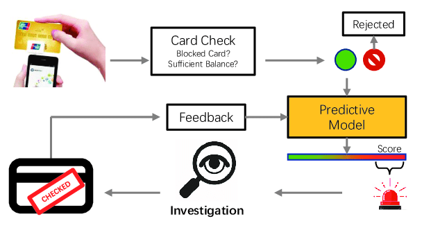
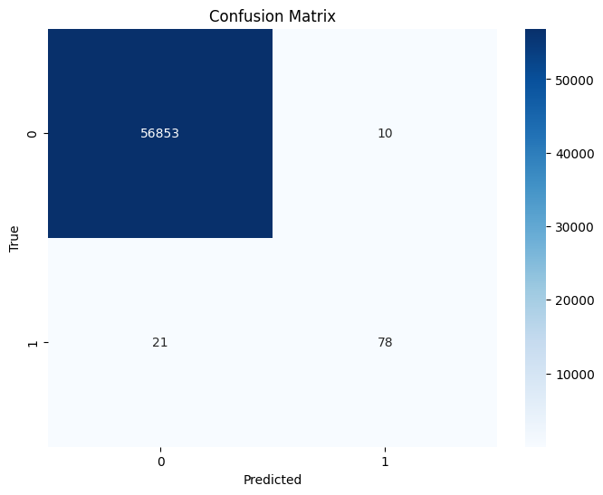

# Credit Card Fraud Detection Using Machine Learning

This repository contains code and resources for a machine learning project focused on credit card fraud detection. The project utilizes various machine learning algorithms to identify fraudulent credit card transactions.

## Table of Contents
- [Introduction](#introduction)
- [Dataset](#dataset)
- [Installation](#installation)
- [Usage](#usage)
- [Qlgorithms Used](#algorithms-used)
- [Technologies Used](#technologies-used)
- [Results](#results)
- [Contributing](#contributing)
- [License](#license)

## Introduction
Credit card fraud is a significant concern in the financial industry. This project aims to address this issue using machine learning techniques to automatically detect fraudulent transactions. By employing a range of algorithms, the project aims to achieve high accuracy and low false positive rates.

## Dataset
The dataset used for this project is [Credit card fraud detection dataset](https://www.kaggle.com/datasets/mlg-ulb/creditcardfraud). It contains historical credit card transaction data, including features like transaction amount, time, and anonymized features. It's important to note that the dataset is unbalanced, with a small percentage of fraudulent transactions.

## Installation
- Clone this repository: `git clone https://github.com/Marzoug-Nabil/credit-card-fraud-detection.git`
- Install required dependencies: `pip install -r requirements.txt`

## Usage
1. Navigate to the project directory: `cd credit-card-fraud-detection`
2. Launch the Jupyter Notebook: `jupyter notebook credit_card_fraud_detection.ipynb`
3. Follow the instructions within the notebook to explore the data, preprocess it, train models, and evaluate their performance.

## Algorithms Used
This project employs two powerful gradient boosting algorithms for classification:

1. **CatBoost Classifier**: CatBoost is a gradient boosting library that handles categorical features naturally without requiring extensive preprocessing. It's known for its excellent out-of-the-box performance and efficient training.

2. **LightGBM**: LightGBM is another gradient boosting framework that uses a histogram-based approach for training. It's optimized for efficiency and is often used for large datasets.

Both algorithms are well-suited for tackling classification tasks, including credit card fraud detection. By leveraging their strengths, this project aims to achieve accurate and efficient fraud detection.

## Technologies Used

- Python
- Jupyter Notebook
- Libraries: Pandas, NumPy, Scikit-learn, Matplotlib, Seaborn, SOM, PCA, Optuna, Sklearn-genetic,Shap (Shapely additive explanation) ,etc.

## Results
## Results

After training both the CatBoost and LightGBM models, here are the evaluation results on the test dataset:

### CatBoost Model Results:
- **Accuracy:** 0.9995
- **Precision:** 0.9605
- **Recall:** 0.7374
- **F1-Score:** 0.8343

### LightGBM Model Results:
- **Accuracy:** 0.9995
- **Precision:** 0.8864
- **Recall:** 0.7879
- **F1-Score:** 0.8342

Confusion Matrices for Both Models:

  
  

Both models have demonstrated impressive accuracy in identifying fraudulent credit card transactions. The CatBoost model excels in precision, while the LightGBM model showcases a balanced performance between precision and recall.

## Contributing
Contributions are welcome! If you'd like to contribute to this project, please follow these steps:
1. Fork this repository.
2. Create a new branch: `git checkout -b feature/new-feature`
3. Commit your changes: `git commit -m 'Add new feature'`
4. Push to the branch: `git push origin feature/new-feature`
5. Create a pull request.

## License
This project is licensed under the MIT License - see the [LICENSE](LICENSE) file for details.

---

Feel free to reach out if you have any questions or suggestions. Happy detecting!

Author: Marzoug Nabil Contact: nabilmarzoug7@gmail.com
